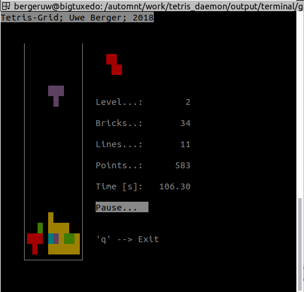
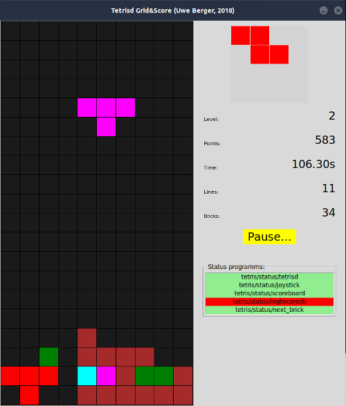
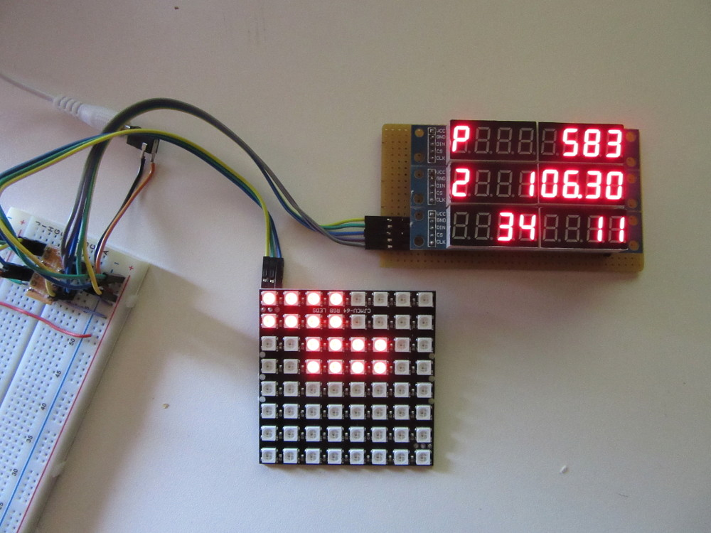
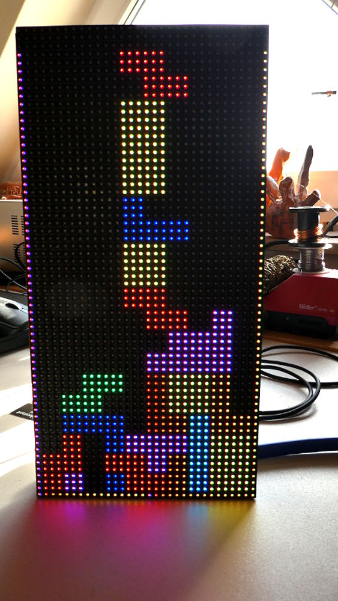

                     
# MQTT-Tetris-Daemon

## Tetris mal anders!

Die Idee ist es, eine Tetris-Engine zu haben, an die man, ohne grosse Probleme, diverse/verschiedene Hard-/Software zur Eingabe und Ausgabe anschliessen kann. Die notwendigen Informationen zwischen den einzelnen Komponenten werden ueber MQTT-Nachrichten ausgetauscht.

                            +---------------+
                            |               |          +------------------+
                            |               |--------->|Terminalprogramme |
    +--------------+        |               |          +------------------+
    |Joystick      |------->|               |
    +--------------+        |               |          +------------------+
                            |               |--------->|Tcl/Tk-Programm   |
    +--------------+        |               |          +------------------+
    |Keyboard      |------->|               |
    +--------------+        |               |          +------------------+
                            |  MQTT-Broker  |--------->|MAX7219-Scoreboard|
    +--------------+        |               |          +------------------+
    |WII-Controller|------->|               |
    +--------------+        |               |          +------------------+
                            |               |--------->|WS2812-Matrix     |
    +--------------+        |               |          +------------------+
    |???           |------->|               |
    +--------------+        |               |          +------------------+
                            |               |--------->|???               |
                            |               |          +------------------+
                            +---------------+
                                   |  ^
                                   |  |
                                   v  |
                             +-------------+
                             |   tetrisd   |
                             +-------------+

## Voraussetzungen/Übersetzen/Starten etc.:

- Zum Betrieb dieser Konstruktion ist ein laufender MQTT-Broker (z.B. mosquitto) notwendig.
- C-Programme:
  - libmosquitto-dev muss installiert sein
  - make clean; make; sudo make install
  - entsprechendes Programm starten ...:-)
- Tcl/Tk-Scripts: Tcl/Tk muss installiert sein
- alle: die individuelle MQTT-Konfiguration kann jeweils über Aufrufparameter angegeben werden
- einige wenige Programme sind mit der Arduino-IDE geschrieben/übersetzt/geflasht worden
- einige der Programme senden ihren momentanen Status, als MQTT-Nachricht, über den Topic tetris/status/\<programmname\>; Payload 0 bedeutet dabei, dass das Programm gestoppt ist, eine 1 bedeutet, Programm läuft; dieser Topic ist auch als LWT ("last will and testament") konfiguriert

## Verzeichnisstruktur

    $ tree -d
    .
    ├── input
    │   ├── joystick            --> Eingabe via Joystick/Gamepad
    │   ├── keyboard            --> Eingabe via Keyboard
    │   └── wii_controller      --> Eingabe via WII-Controller (noch nicht fertig)
    ├── output
    │   ├── hardware
    │   │   ├── max7219_test    --> Test MAX7219
    │   │   ├── scoreboard      --> Scoreboard via MAX7219
    |   |   ├── next_brick      --> Anzeige "Naechster Stein" auf einer 8x8-WS2812-Matrix
    |   |   └── 64x32_matrix    --> Grid auf einer 64x32-Matrix (Stichwort: pxmatrix)
    │   ├── tcltk
    │   │   └── grid            --> Grid & Score via Tcl/Tk
    │   └── terminal
    │       ├── grid            --> nur Grid in einem Terminal ausgeben
    │       ├── grid_score      --> Grid & Score in einem Terminal ausgeben
    │       └── score           --> nur Score in einem Terminal ausgeben
    └── tetrisd                 --> die Tetris-Engine

## Aufrufparameter tetrisd

    tetrisd [-h <mqtt-host>]  --> MQTT-Broker      (default: localhost)
            [-p <mqtt-port>]  --> MQTT-Port        (default: 1883)
            [-U <mqtt-user>]  --> MQTT-User        (default: "")
            [-P <mqtt-pwd>]   --> MQTT-Pwd         (default: "\")
            [-q <mqtt-qos>]   --> MQTT-QoS         (default: 0)
            [-i <mqtt-id>]    --> MQTT-Client-ID   (default: tetrisd)
            [-d]              --> Start als Daemon (default: nein)
            [-?]              --> Hilfe ausgeben

...I/O-Programme analog bzw. siehe Quelltext ;-)!

## MQTT-Topics (tetrisd):

###  abonnierte Topics:

    tetris/key          --> 1 --> Spielende (derzeit ohne Funktion)
                        --> 2 --> Spielpause ein/aus
                        --> 3 --> neues Spiel
                        --> 4 --> Spielstein fallen lassen
                        --> 5 --> Spielstein rotieren
                        --> 6 --> Spielstein nach links
                        --> 7 --> Spielstein nach rects
    tetris/get_score    --> 1 (Spielstand, Grid etc. anfordern)

###  sendende Topics:

    tetris/score/time           \
    tetris/score/level           \
    tetris/score/bricks           > aktueller Spielstand
    tetris/score/lines           /
    tetris/score/points         /
    tetris/gamestatus           --> 0 (running), 1 (Pause), 2 (Game over)
    tetris/finalscore           --> finaler Punktestand (in JSON)
    teris/next_brick            --> als 2d-Abbild
    tetris/grid                 --> als 2d-Abbild
    tetris/create_game_screen   --> 1 (leeres Spielfeld neu zeichnen)
    tetris/destroy_game_screen  --> 1 (Spielfeld weg...)
    tetris/status/tetrisd       --> 0 (tetrisd gestoppt), 1 (tetrisd laeuft)
    
    LWT:
    ----
    tetris/status/tetrisd       --> 0

## Service-Scripts:

- batch_make.sh: make-Kommando in allen Unterverzeichnissen ausfüheren, wenn ein Makefile gefunden wurde; der entsprechende make-Befehl wird als Kommandozeilenparameter dem Script mitgegeben
              
## Bilder

## Danke!
- Tutorial zur Konfiguration eines Wiimote-Controllers via Bluetooth als Joystick an einen Raspberry Pi: https://pimylifeup.com/raspberry-pi-wiimote-controllers/

## Autor
Uwe Berger; 2017, 2018, 2019, 2020

bergeruw@gmx.net

Have fun!
